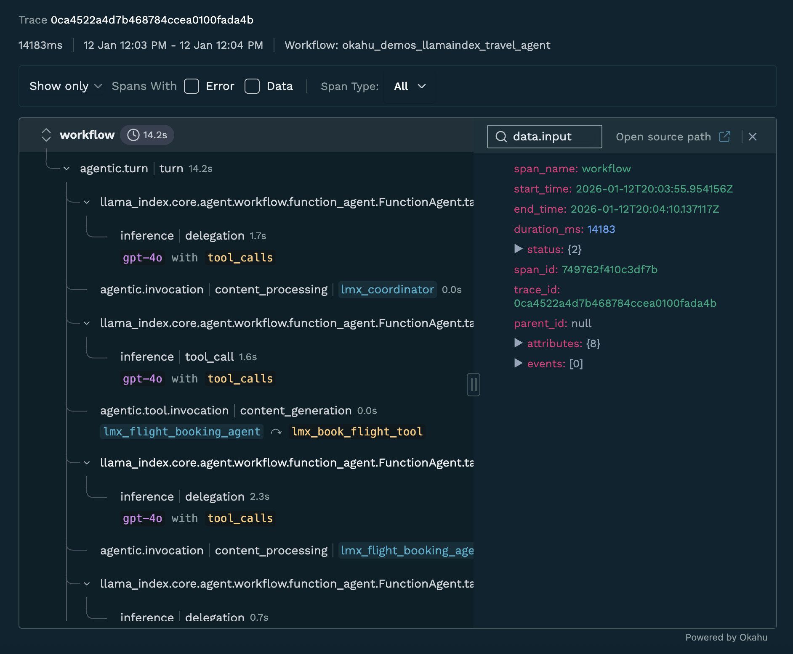

# Okahu agent demo with OpenAI + Langgraph
This repo includes a demo agent application built using OpenAI & Langgraph that is pre-instrumented for observation with Okahu AI Observability cloud. 
You can fork this repo and run the app in Github Codespaces or laptop/desktop to get started quickly.

## Try Okahu with this Agentic app

To try this agent 
- Fork this repo and run in the Github Codespace 
- To run this on Mac 
  - Install python dependencies: ```pip install -r requirement.txt```
- To run this on Windows
  - Install python dependencies: ```pip install -r requirement.txt```

You'll need 
- An OpenAI subscription and an API key to [OpenAI developer platform](https://platform.openai.com/overview)
- An Okahu tenant and API key to [Okahu AI Observability Cloud](https://www.okahu.co)
  - Sign up for Okahu AI accout with your LinkedIn for Github ID
  - Once you login, nagivate to 'Settings' on the left navigation bar and click on 'Generate Okahu API Key'
  - Copy the API key generated and save. Note that you'll not be able to extract that API key after you navigate away from that page.

## Configure the demo environment
- Copy the file agent_env.sh.template to agent_env.sh
- Edit the agent_env.sh file to add the OpenAI API Key and Okahu API key and save

## Run the travel agent app 
This application is an travel agent app that mocks travel related tasks like flight booking, hotel booking and checking weather in a city.
It's is a python program using Langgraph Agent framework. 
The app uses OpenAI gpt-4o model for inference.

1. Source the agent environment
  ```source agent_env.sh```
2. Start the mock weather MCP server
  ```python weather-mcp-server.py > mcp.out 2>&1 &```
3. Verify mcp server is running
  ```cat mcp.out```
  The above command prints content of mpc.out file which should show a message `Application startup complete`
4. Run the pre-instrumented travel agent app with following command
   ```python lc-travel-agent.py```
   The application will prompt you for a travel booking task. You can enter something like `Book a flight from SFO to BOM next week. Book Marriot hotel in central mumbai. Also how't the weather going to be in Mumbai next week?`
   It should responds with successful booking of flight and hotel, as well as weather forcast.

## Trace Results

After running the travel agent app, you can view the trace results captured by Okahu. The trace contains detailed information about the agent's execution, including tool calls, LLM interactions, and workflow steps.



For detailed trace data, see the trace file: [monocle_trace_okahu_demos_llamaindex_travel_agent_0ca4522a4d7b468784ccea0100fada4b_2026-01-12_12.04.00.json](.monocle/monocle_trace_okahu_demos_llamaindex_travel_agent_0ca4522a4d7b468784ccea0100fada4b_2026-01-12_12.04.00.json)
